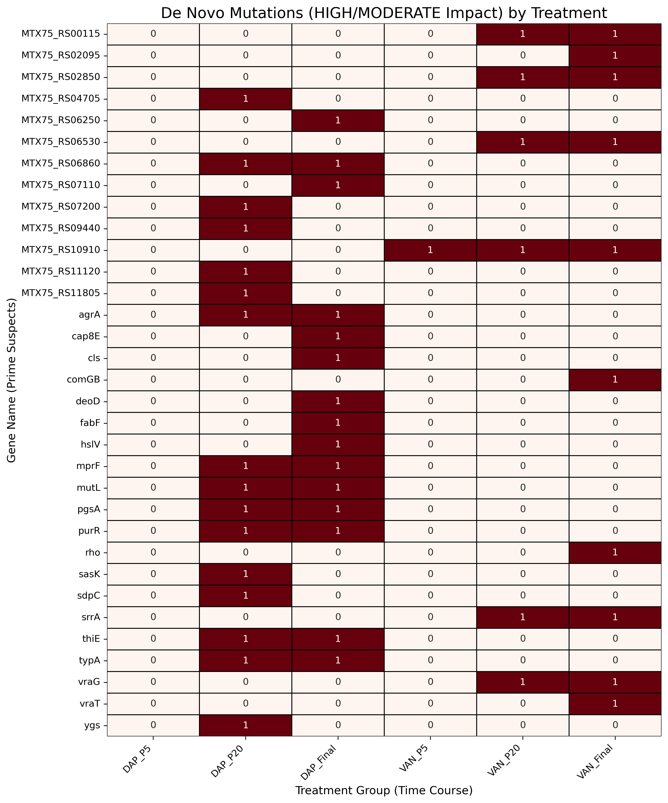

# 1. Bacterial Variant Calling: S. aureus (PRJNA325350)

This project is a complete bioinformatics pipeline to identify and interpret genetic mutations in *Staphylococcus aureus* samples (PRJNA325350) that evolved resistance to Daptomycin (DAP) and Vancomycin (VAN).

The pipeline starts from raw FASTQ reads, performs QC, alignment (BWA), variant calling (GATK), and annotation (SnpEff), and concludes with a deep downstream analysis (Pandas) and visualization (Seaborn) to identify the "prime suspect" genes responsible for antibiotic resistance.

## 2. Key Findings: The "De Novo" Mutation Hitmap

The primary goal was to find *de novo* mutations (variants present in treated samples but absent from the Control). The analysis successfully identified 48 such mutations.

The visualization below summarizes the key evolutionary pathways taken by the DAP and VAN lineages:



### 3. Biological Interpretation

The analysis revealed distinct and clinically relevant resistance strategies:

1.  **Daptomycin (DAP) Resistance (Membrane Adaptation):**
    * The DAP lineage developed significant `missense` mutations in genes critical for cell membrane homeostasis, including **`mprF`** (a well-known DAP resistance gene) and **`agrA`** (a master regulator of virulence).

2.  **Vancomycin (VAN) Resistance (Cell Wall Stress Response):**
    * The VAN lineage developed `missense` mutations in sensor systems like **`vraG`** and **`vraT`**, which are key components of the `Vra` system that senses cell wall damage.

3.  **The "Hypermutator" Engine (`mutL`):**
    * The most significant finding was the emergence of **high-impact `frameshift` mutations** in the DNA mismatch-repair gene **`mutL`** in the DAP lineage. This "knock-out" likely created a "hypermutator" state, accelerating the rate of mutation and allowing genes like `mprF` to acquire resistance mutations rapidly.

## 4. Methodology: The Pipeline (Jupyter Notebooks)

The project follows a clean, step-by-step notebook workflow. Each notebook is self-contained and completes one major stage of the pipeline.

* `00_Setup_and_Download.ipynb`: Installs all tools (GATK, BWA, SnpEff, etc.) and downloads the 7 SRA samples.
* `01_QC_and_Trimming.ipynb`: Runs FastQC, identifies adapters, and cleans reads using `fastp`.
* `02_Mapping_and_BAM_Processing.ipynb`: Indexes the reference and maps reads using `bwa mem` (with Read Groups) and `samtools`.
* `03_Variant_Calling_GATK.ipynb`: Creates sequence dictionaries and calls variants using `gatk HaplotypeCaller` to produce 7 VCF files.
* `04_Variant_Annotation.ipynb`: Builds a custom SnpEff database and annotates the VCF files, producing 7 `.ann.vcf.gz` files and 7 `.genes.txt` reports.
* `05_Downstream_Analysis_and_Interpretation.ipynb`: Programmatically aggregates the 7 reports using `pandas`, performs a set-difference analysis to find *de novo* mutations, and saves the final 48 "prime suspects" to a CSV.
* `06_Final_Visualization.ipynb`: Loads the final CSV and generates the publication-quality heatmap using `matplotlib/seaborn`.

## 5. How to Reproduce

1.  **Clone this repository:**
    ```bash
    git clone [https://github.com/refmyoussef-source/project_variant_calling.git](https://github.com/refmyoussef-source/project_variant_calling.git)
    cd project_variant_calling
    ```

2.  **Create the Conda Environment:**
    * This project's dependencies are managed in the `environment.yml` file.
    ```bash
    conda env create -f environment.yml
    conda activate variant_call_env
    ```

3.  **Run the Pipeline:**
    * Open the `notebooks/` directory and run the notebooks in numerical order (from `00` to `06`).